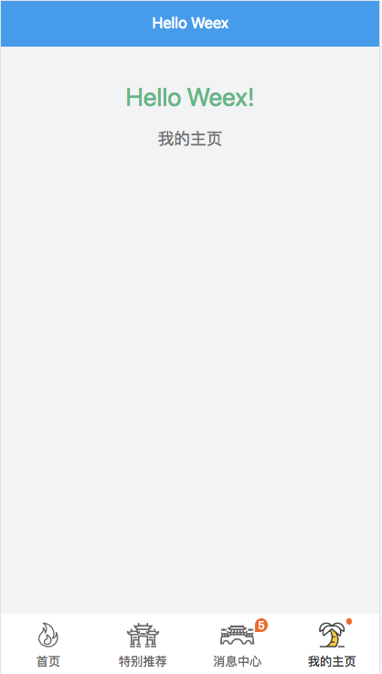
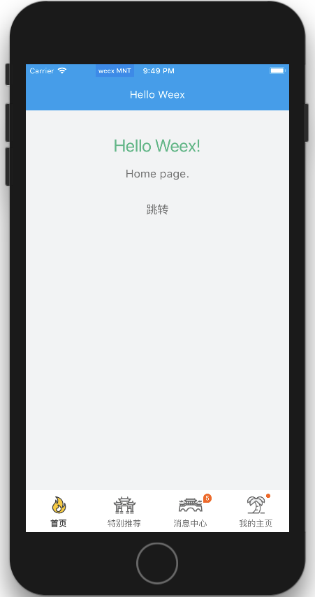
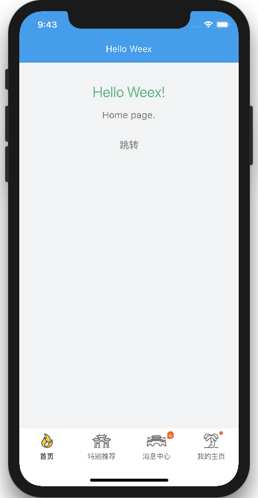

# Demo

* [Demo on github](http://fuckdoctors.github.io/hello-weex/preview.html?page=index.js)

* [Demo on coding.net](http://zhaobc.coding.me/hello-weex/preview.html?page=index.js) (备用地址，更新不及时)

公司没有WIFI，Playground上无法确认，暂时放到公网上，然后用手机上的Playground扫描确认。手动滑稽(￣▽￣)"

现在刚开始学习，难免会遇到一些问题，Demo用来向别人更直观的展示问题。

所以，Demo是有错的，希望以后慢慢解决。。。

## Screenshots



## Commands

### npm run build:docs (新增命令)

发布Demo，需要修改configs/config.js里的下面的内容。
```
server: {
  domain: 'fuckdoctors.github.io/hello-weex',
  enableHttps: true
}
```

### npm run build:report (新增命令)

Webpack Bundle Analyzer

### npm start

Starts the development server for you to preview your weex page on browser.
You can also scan the QR code using weex playground to preview weex page on native.

### npm run dev

Open the code compilation task in watch mode.

### npm run ios

(Mac only, requires Xcode)
Starts the development server and loads your app in an iOS simulator.

### npm run android

(Requires Android build tools)
Starts the development server and loads your app on a connected Android device or emulator.

### npm run pack:ios

(Mac only, requires Xcode)
Packaging ios project into ipa package.

### npm run pack:android

(Requires Android build tools)
Packaging android project into apk package.

### npm run pack:web

Packaging html5 project into `web/build` folder.

### npm run test

Starts the test runner.
